# HathiMia

## A downloader for HathiTrust Full View books.

## HathiTrust开放全文下载器

## [English Version](./README_EN.md)

**注意：本软件目前仅有Windows版，其他平台的版本后续可能会视需求推出，也欢迎大佬pr。**

**注意：本软件在墙内可能使用体验不佳，欢迎积极测试反馈提建议。**

众所周知，HathiTrust (https://www.hathitrust.org/) 上有很多开放阅读的优秀书籍，但其中有很多书籍官方未提供一键式全本下载，每次只能下载一页。

仅仅是在线阅读，无法满足我们在阅读文献过程中的许多个性化需求，包括但不限于：

- 标注，并且不希望被存储在服务器上；
- 无网络时的阅读。

因此，对于这些内容开放的书籍，我 ([aiyamia](https://github.com/aiyamia)) 制作了这个下载工具，方便需要全本pdf文件的读者。

由于能力水平所限，目前功能有限，部分功能可能还有bug，希望能得到大佬们的pull request。

## 我的心里话

1. 此作品的主要功能仰赖于HathiTrust官方对于许多书籍的开放，我们应当始终对HathiTrust官方保持一颗感恩的心；
2. 原作者 ([aiyamia](https://github.com/aiyamia)) 希望此作品的功能被个人或小团体用于正常的学术/求知用途；
3. 原作者 ([aiyamia](https://github.com/aiyamia)) 不希望看到有人/团体通过此作品大规模下载、囤积资源，不论是否出于要构建“个人数据库/图书馆”的目的。因为这样的行为：一是盲目下载会造成大量的存储资源浪费；二是人的贪欲容易使得积累过多自己并不会真正使用的资源；三是会增加HathiTrust服务器的负担。出于第一点，我们感恩HathiTrust官方的一种方式就是不去滥用他给我们的能力。
4. 此作品如果疑似会侵犯您/您的组织的正当权益，您可以通过任何途径联系我，我 ([aiyamia](https://github.com/aiyamia)) 会在第一时间进行沟通和处理。

## 安装

1. 从这里 (https://github.com/aiyamia/HathiMia/releases/latest) 下载最新版本的`HathiMia.rar`的压缩包；
2. 使用解压软件将其解压至你希望的路径。

## 开始使用

打开HathiTrust网站：https://www.hathitrust.org/ ，如下图选上`Full-text`和`Full view only`，然后输入关键词搜索你想要的书籍。

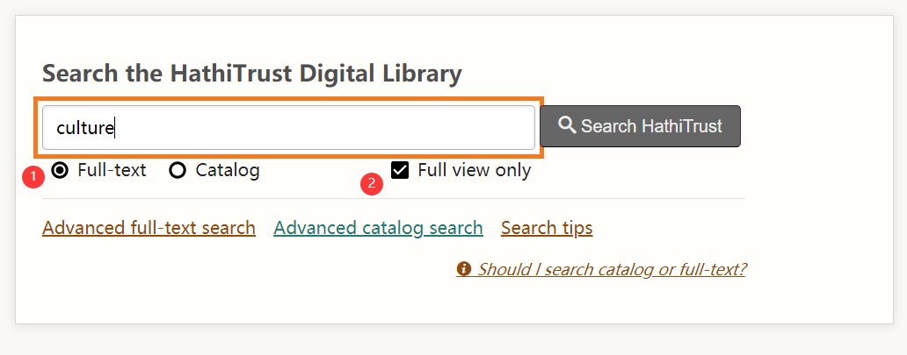

在搜索结果中找到你需要下载的书籍，如下图点击`Full View`进入书籍阅读器。

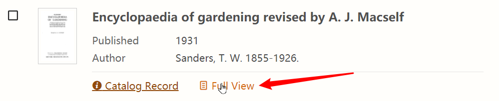

当你进行简单的浏览之后，如果确认需要下载全文pdf的话，请先如下图所示在阅读器左边栏找到`Download`折叠菜单，单击展开。

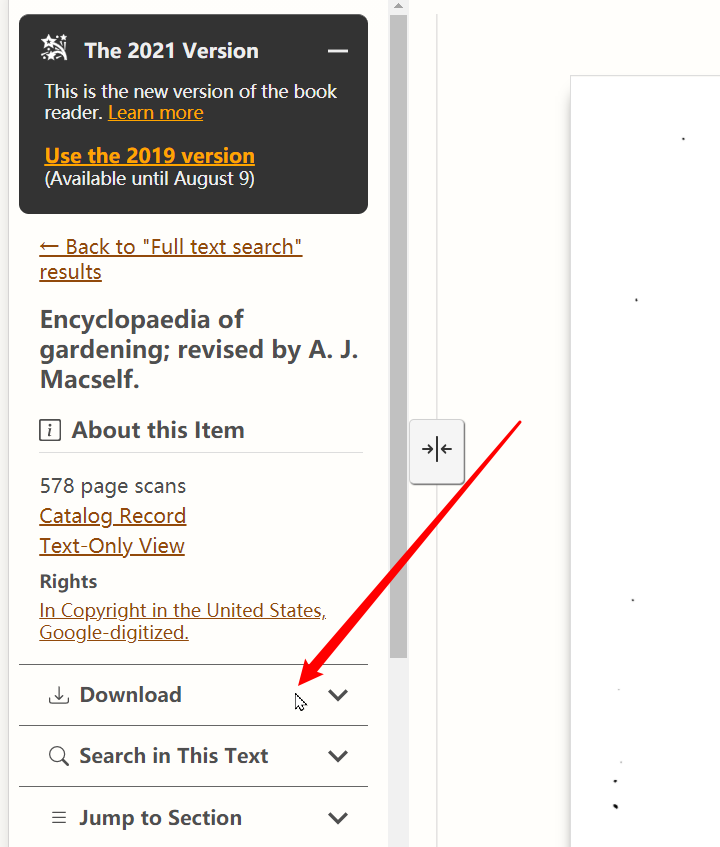

假如展开后呈现如下图所示的样子，那么就可以使用本软件下载这本书的全文pdf。

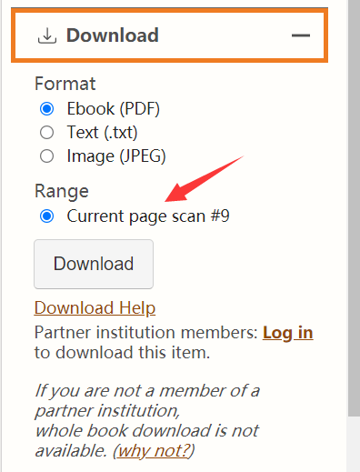

当你决定要下载的时候，复制阅读器页面最上方的网址，如下图所示。

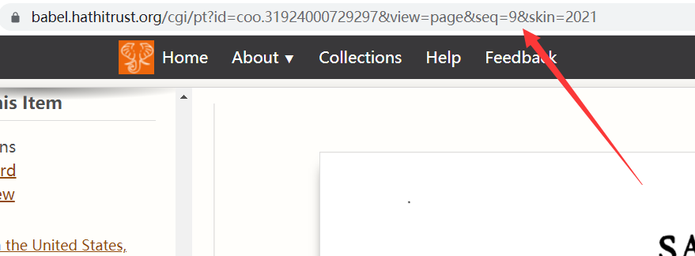

打开HathiMia软件（即，双击你所解压之后的HathiMia文件夹中的`HathiFullViewArchive_1_Wpf.exe`），将你刚刚复制的链接地址粘贴到`书籍链接`栏。然后设置所需的起始页码和结束页码以及为最后生成的pdf设置保存路径和文件名。

注意：假如你不是第一次使用本软件，会发现在软件打开后这些栏里面已经有内容了（如下图），这是系统保留的上次操作时输入的内容，对于新下载，你需要将其替换掉。

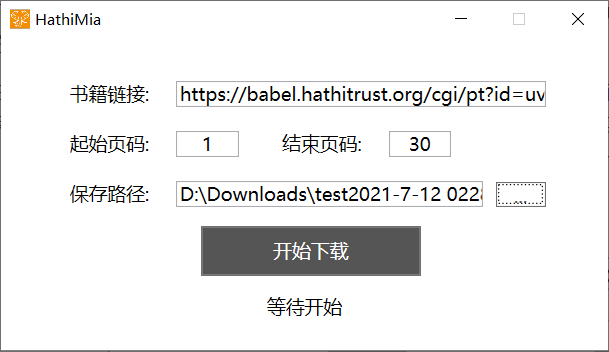

这里所说的页码，是指HathiTrust阅读器页面下方给出的这个页码（如下图），也就是pdf的页码，而不是书籍内部所印刷的页码。

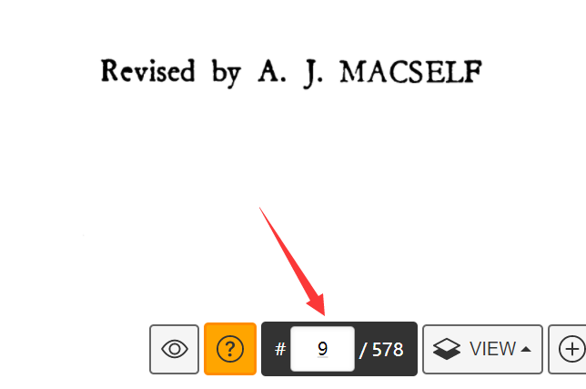

当一切数据设置完毕，就可以点击`开始下载`按钮了。

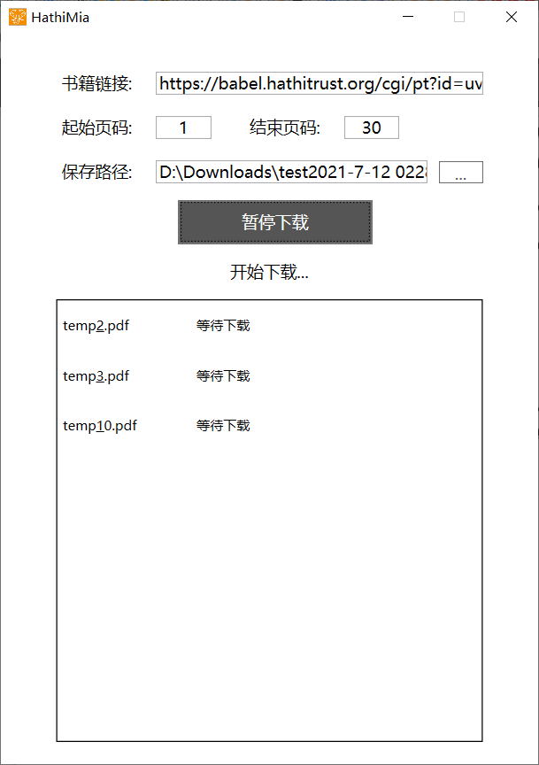

软件每下载10页会休息5秒，这是因为过快的下载请求会使得HathiTrust服务器拒绝你进一步的下载。古人云：欲速则不达。求知之路漫漫，不差这几分几秒，这段时间你完全可以将HathiMia最小化（看到窗口右上角××左边的最小化按钮了吗），然后去学习其他的知识。

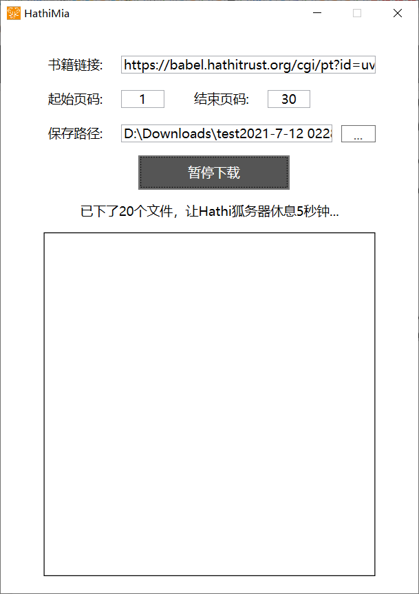

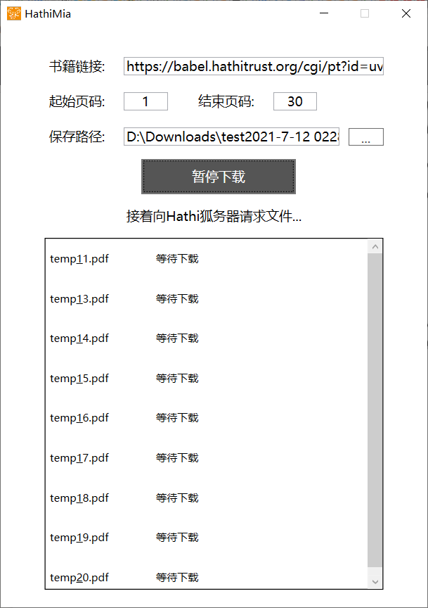

有时会因为网络问题或者短期内请求次数过多而导致部分页面下载失败，就会出现下图所示的情况，这时候请你点击`继续下载`按钮。你也可以在你所设定的保存文件夹下面`你的pdf名_temp`这个文件夹中监测每页的下载情况，假如不论下载开始多久，文件的大小几乎全为0，那么应该是你的网络问题导致的。此时请你直接关掉软件。要解决这个问题最好的方法就是翻墙，但是也可以等待一会再试试。

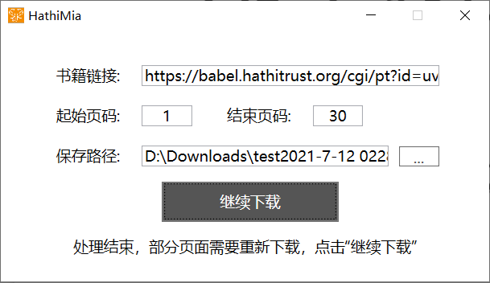

下载完毕界面：

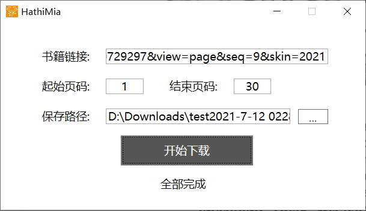

在下载完毕后，会自动打开生成的pdf供你检查。

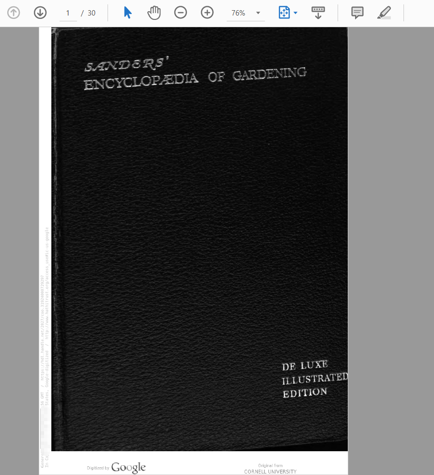

在你对所生成的pdf检查无误后（一般都不会有问题），请在你所设定的保存文件夹下面删除`你的pdf名_temp`这个文件夹，这里面就是这本书每一页的pdf。目前程序还没有设定为自动删除这个文件夹，因为假如希望扩展刚刚下载的这个pdf的页码范围，会自动检测已经下载的这些部分，不会重下这些内容。不过后期可能会加上自动删除这个临时文件夹的功能。出于合理利用资源的想法，建议大家尽量挑选自己感兴趣的部分进行下载而不是每次都下一整本。

## 关于暂停功能

你会发现在下载中按钮会变成`暂停下载`，但是我目前其实还没有真正实现暂停功能——大部分情况下是不奏效的。所以当你需要暂停的时候，请直接关软件（

希望大佬们来给我pr或者指点（

## 再次声明

1. 此作品的主要功能仰赖于HathiTrust官方对于许多书籍的开放，我们应当始终对HathiTrust官方保持一颗感恩的心；
2. 原作者(aiyamia)希望此作品的功能被个人或小团体用于正常的学术/求知用途；
3. 原作者(aiyamia)不希望看到有人/团体通过此作品大规模下载、囤积资源，不论是否出于要构建“个人数据库/图书馆”的目的。因为这样的行为：一是盲目下载会造成大量的存储资源浪费；二是人的贪欲容易使得积累过多自己并不会真正使用的资源；三是会增加HathiTrust服务器的负担。出于第一点，我们感恩HathiTrust官方的一种方式就是不去滥用他给我们的能力。
4. 此作品如果疑似会侵犯您/您的组织的正当权益，您可以通过任何途径联系我，我(aiyamia)会在第一时间进行沟通和处理。