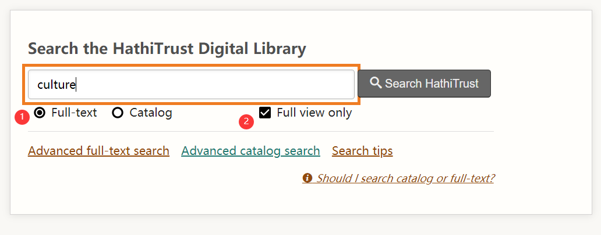
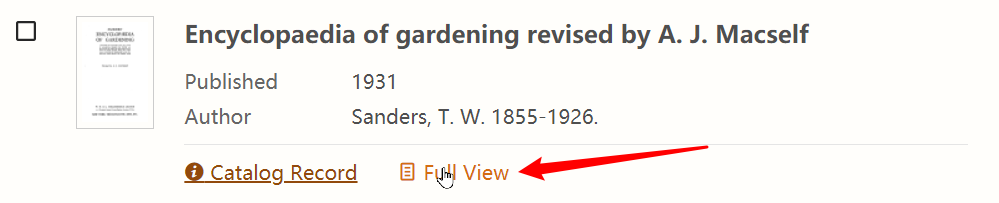
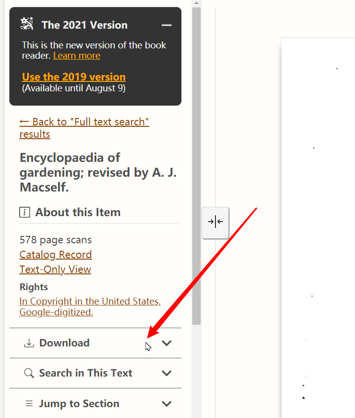
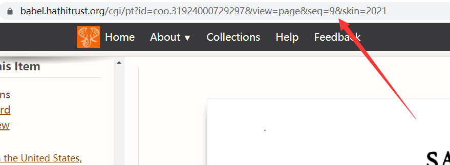
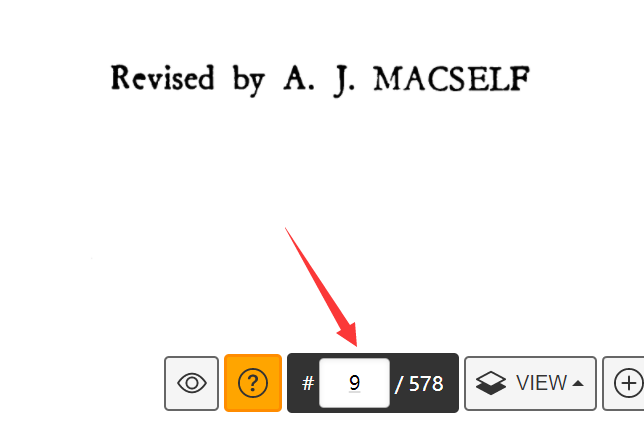
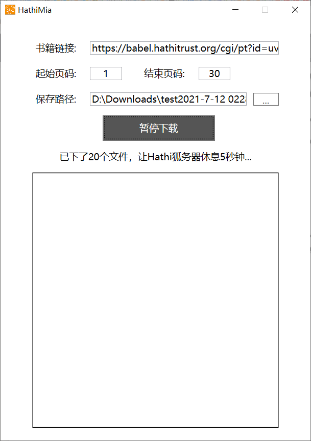
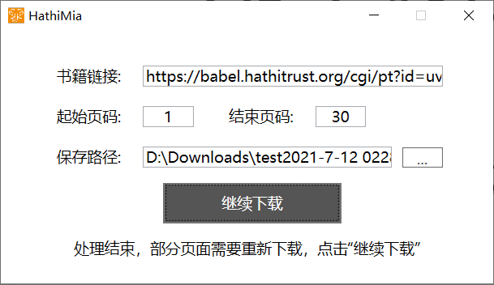

# HathiMia

## A downloader for HathiTrust Full View books.

**Note**: This app **now only supports Windows,** other platforms (MacOS/Linux/Web/Browser) will be provided if it's a general need. Your PR on these platform is also welcome.

As we all know, there are so many great books on HathiTrust(https://www.hathitrust.org/) which can be viewed, but many of them can not be downloaded in one click. Although we can download once a page, we need multiple pages in many scenarios, then we have to do the download operation many times. 

Why sometimes we prefer downloading yet reading online? Because with a local file, we can:

- Anotate on the text and don't want them stored on some servers;
- Read offline;
- etc.

Thus, I (aka [aiyamia](https://github.com/aiyamia)) made this tool for people who need to download the whole book in pdf conveniently. And for my limited experience on C# programming, the functionality is limited and even buggy sometimes. Your pull request and issue are welcome. I am willing to know the issues you encounter when using this app.

## I want to tell you

1. The main functionality of this work is owing to the opening of the contents by HathiTrust, for which we are supposed to keep grateful to HathiTrust.
2. The original author of *HathiMia* (aka [aiyamia](https://github.com/aiyamia)) wishes this app to be used by individual or small group for normal academic/knowledge building use.
3. The original author of *HathiMia* (aka [aiyamia](https://github.com/aiyamia)) does **not** want this app to be used by any individual or group for massive downloading and resource hoarding, no matter whether it is for building individual knowledge database/library. Now that we are grateful to HathTrust, we need to do our best to reduce the server pressure of it. "**Respect, not just take advantage**" is my ethics.
4. If this work is suspected of infringing on the legitimate rights and interests of you/your organization, you can contact me through any means, and I will communicate with you and deal with it as soon as possible.

## Installation

1. Download the rar file named `HathiMia.rar ` from the latest release page (https://github.com/aiyamia/HathiMia/releases/latest).
2. Unpack the downloaded rar file to any path as you wish.
3. **Wallah!** You can start using *HathiMia* by double clicking the `HathiFullViewArchive_1_Wpf.exe` file in the unpacked folder.

## Getting Started

Open HathiTrust's website, https://www.hathitrust.org/, and make sure to check the `Full-text`和`Full view only` (as shown in the figure below). Type your keywords and click the `Search HathiTrust` button on the right.

Find the book you need in the search result and click `Full View` to navigate to the reader page (as shown in the figure below).

If you really decide to download the whole book as a bulk, please first check whether it is provided by official by clicking the `Download` item in the left column shown in the figure below.

After the item expanded, if it is like the situation in the following picture (which means you can only download page by page from the site), then it is time to turn to *HathiMia*.

Copy the url link (address) upon the very top of the page as shown in the following picture.

Open *HathiMia* by double clicking the `HathiFullViewArchive_1_Wpf.exe` file in the unpacked folder, and paste the copied address to the text box after `书籍链接`. And then you need to set the starting and ending page number respectively in the  text box after `起始页码` and `结束页码`. Finally, set the saving path and the name of the resulting pdf file in the  textbox after `保存路径`.

**Note**: If it's not the first time you use *HathiMia*, you will find the text boxes are filled after launching the app. These are the info you typed last time and the app stores them for your convenience. So, if you want to download a new book, you need to replace them with the new info.

The so-called page number here, is for number given in the navigator bar on the bottom of the reader page, which is the page number of a pdf rather than the number printed on the pages of the book.

After everything is set, you can click the `开始下载` button to start downloading.

The process will pause 5 seconds after every 10-page download, which is because a faster speed will cause the server to stop you from continueing downloading. Sometimes faster means slower. As the download is going on, you can minimize the window of HathiMia (see the minimize button at the top-right?), and do other stuff on your pc.

Sometimes a part of the pages is not successfully fetched due to the massive requests to HathiTrust's server or other network issues, and you will get the result as the following picture shown. Here you just need to click the `继续下载` button to retry your download. You can also monitor the download process by looking at the files' size in the `your_pdf_name_temp` folder which is automatical generated in your specified saving path. If almost every file is still zero size after the download is started for a while, you need to check your network now.

 Download accomplished:

The generated pdf of the whole book will popup automatically after a successful download.

After checking the pdf, please delete the `your_pdf_name_temp` folder which contains the pdf of every page in your specified saving path. The reason why I left this deletion manual is to reduce repeated requests of the same pages when you just want to expand/change your page range after a download. But this deletion might be made automatical in the next release of *HathiMia*. For using the resources provided by HathiTrust properly, please try to pick the interested range of the book to download yet the whole book every time.

## Pause/Cancellation

During the download, you will find the text on the button turns to `暂停下载`, but actually pause and cancellation haven't been successfully implemented (I AM SO SORRY). So when you want pause or cancel the download, please just close the window, and the download will resume next time you click start if you haven't delete the `your_pdf_name_temp` folder.

I will be grateful for your help on this issue.

## Statement

1. The main functionality of this work owe to the opening of the contents by HathiTrust, for which we are supposed to keep grateful to HathiTrust.
2. The original author of *HathiMia* (aka [aiyamia](https://github.com/aiyamia)) wish this app to be used by individual or small group for normal academic/knowledge building use.
3. The original author of *HathiMia* (aka [aiyamia](https://github.com/aiyamia)) does **not** want this app to be used by any individual or group for massive downloading and resource hoarding, no matter whether it is for building individual knowledge database/library. Now that we are grateful to HathTrust, we need to do our best to reduce the server pressure of it. "**Respect, not just take advantage**" is my ethics.
4. If this work is suspected of infringing on the legitimate rights and interests of you/your organization, you can contact me through any means, and I will communicate and deal with it as soon as possible.